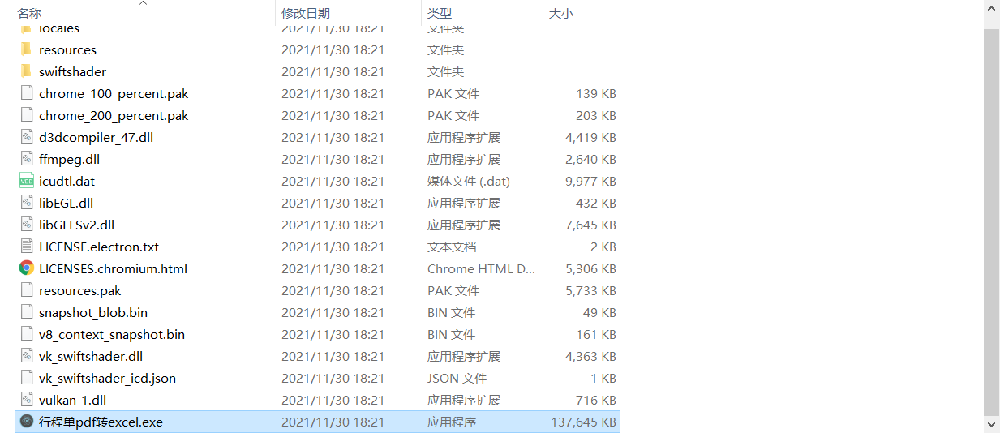
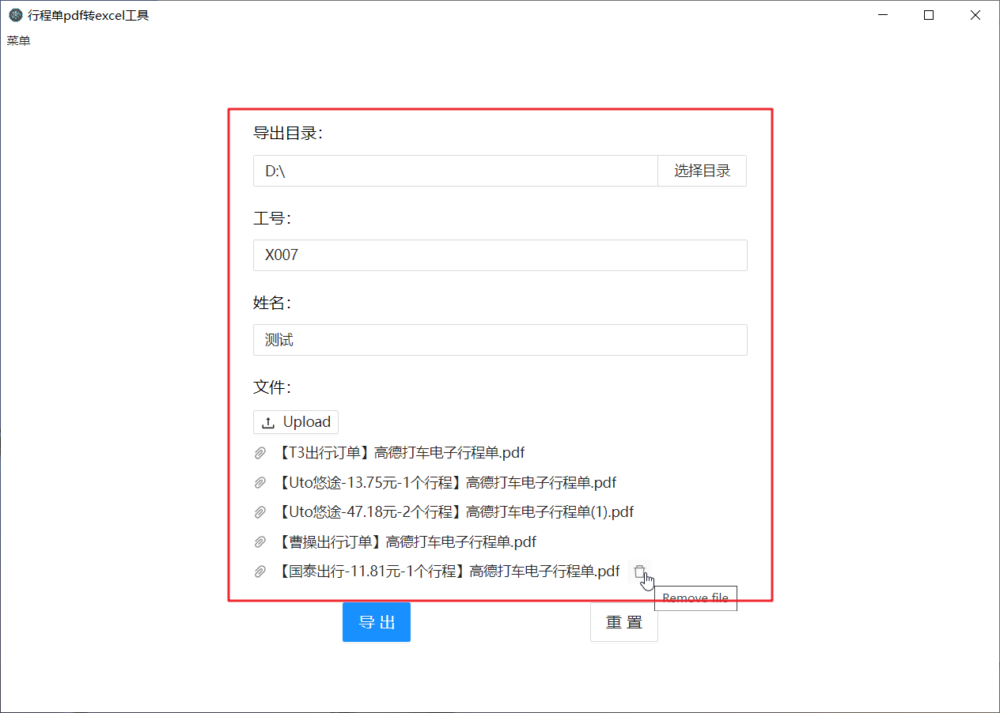
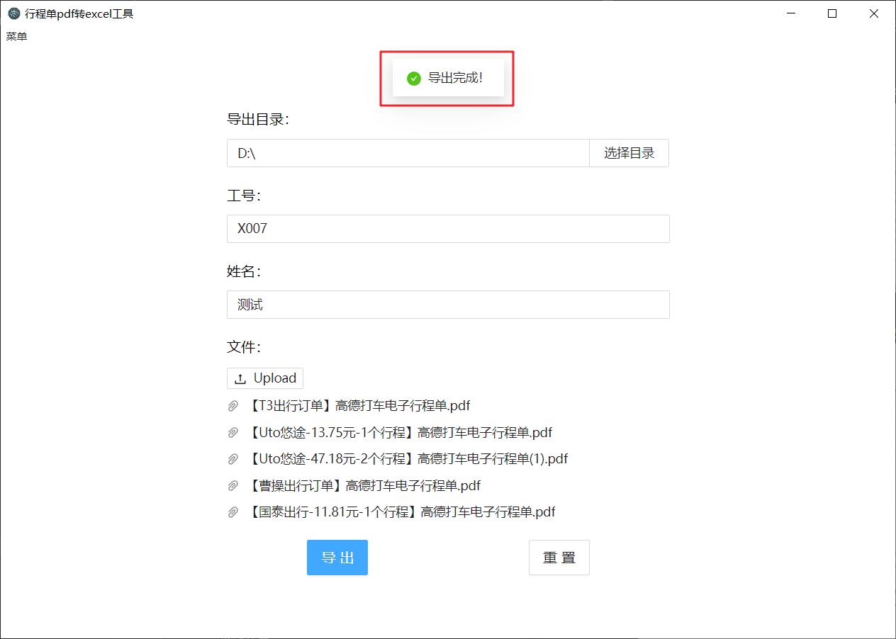
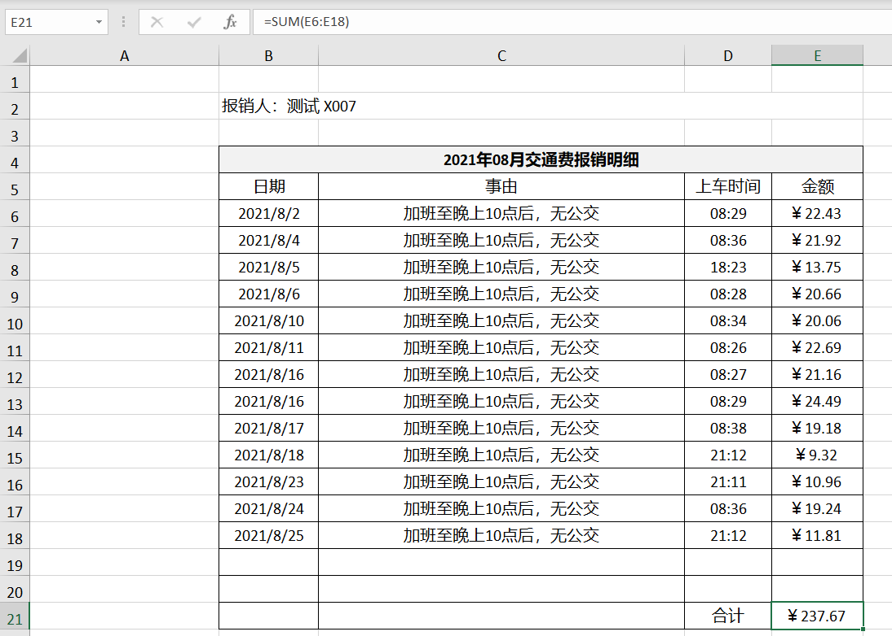

# 行程单pdf转excel-electron

## 一、介绍
主要功能是将滴滴、高德、T3行程单pdf转报销格式excel。有如下特性：
- 除了滴滴、高德、T3，其他平台的行程单pdf也可以加对应的数据提取函数来支持
- 桌面应用，经自测支持window7、window10，其他操作系统（Linux / Mac）平台在技术上也可以支持，但我觉得没必要，就不导出其他操作系统的包了
- 离线执行，不联网、不发请求，本地执行
- 不依赖其他环境，nodejs+Chromium已经被打包到应用中，可以在没有nodejs、Chromium的电脑上正常运行
- 导出的Excel自带单元格格式，如：日期、时间、金额、合计公式，便于导出后对表格进行手动修改，如出租车发票手动录入情况
- 导出的Excel自动按时间排序行程记录，自动根据时间生成三种类型的表格标题（跨年、跨月、不跨月）
- 初次投入使用，可能在特殊情况下会存在bug，欢迎反馈

## 二、使用步骤
### 1.下载附件，解压后执行“行程单pdf转excel.exe”文件

### 2.录入导出目录，输入工号、姓名，选择行程单pdf
注：暂未做文件校验，所以必须选择正确的pdf文件，否则无法获取到行程记录

### 3.点击 “导出” 按钮，待提示 “导出完成” 后，到导出目录可查看

### 4.查看导出的Excel文件
注：事由默认为 “加班至晚上10点后，无公交”，若需更改事由，可导出后自行调整内容

## 三、技术栈
electron、typescript、nodejs、react hooks、antd、postcss | 原子化css | tailwindcss、eslint + prettier、发布npm包

## 四、待办列表
- [x] 实现基本功能
- [x] 尝试使用tailwandcss，<a href="https://www.yuque.com/u21207555/rcmm3b/ewc6a0">初次使用tailwandcss感受</a>
- [ ] husky
- [ ] 优化pdf信息提取算法

## 五、关于打包后执行exe程序报错问题
2个解决方法：
1. 直接下载使用release中发布的包
2. 将src/pdf.js替换node_modules/pdf2json/lib/pdf.js，然后再执行打包命令npm run package。因为该应用的核心依赖包travel-pdf-to-excel依赖于pdf2json包，而pdf2json包有个<a href="https://github.com/modesty/pdf2json/issues/161">骚操作</a>导致nodejs主进程报错中断
